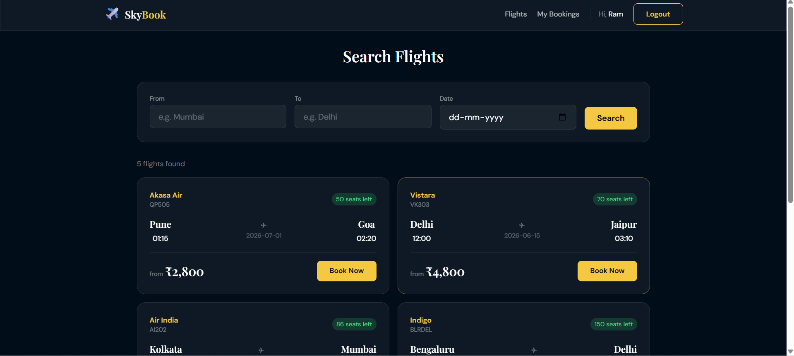
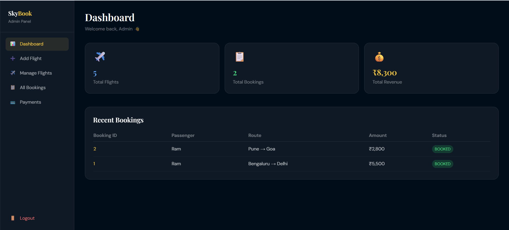
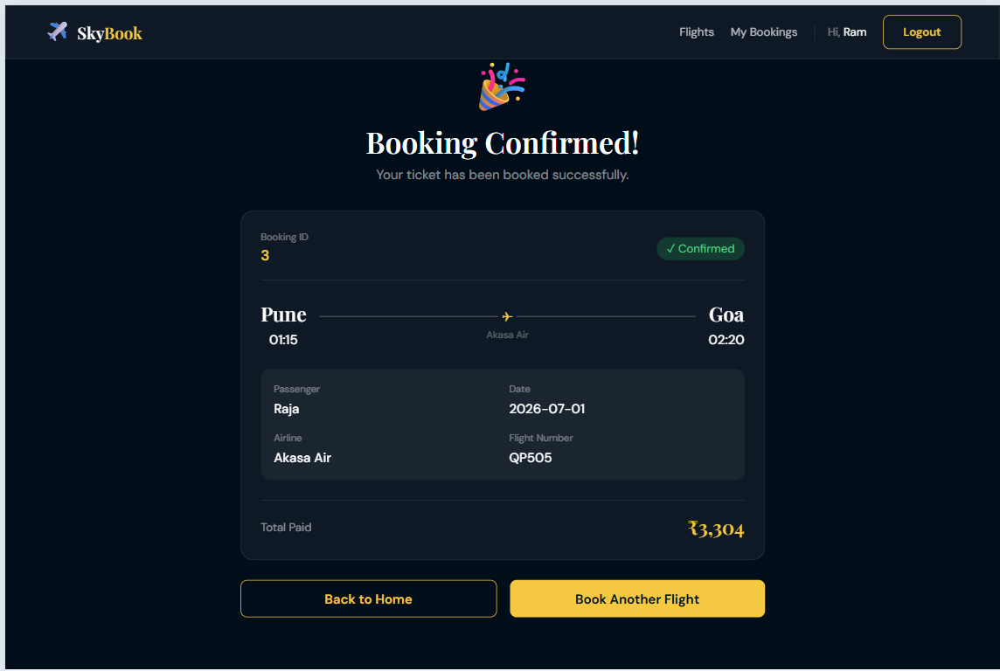

## 🌐 Live Demo

- Frontend: https://skybook02.vercel.app/
- Backend API: https://skybook-airline.onrender.com


# ✈️ SkyBook Airline Reservation System

A full-stack Airline Reservation System built using Spring Boot, React.js, PostgreSQL, JWT Authentication, and Role-Based Authorization.

---

## 🚀 Features

### Admin Features

* Admin Login
* Add Flight
* Update Flight
* Delete Flight
* Manage Flights
* View All Bookings
* View Payments
* Dashboard Management

### User Features

* User Registration
* User Login
* Search Flights
* View Available Flights
* Book Flights
* Passenger Management
* Payment Processing
* Booking Confirmation
* My Bookings

### Security Features

* JWT Authentication
* Role-Based Authorization
* Protected Routes
* Secure API Access

---

## 🛠 Tech Stack

### Backend

* Java 17
* Spring Boot
* Spring Security
* Spring Data JPA
* JWT Authentication
* PostgreSQL
* Maven
* Lombok

### Frontend

* React.js
* Vite
* React Router DOM
* Axios
* Tailwind CSS

---

## 📁 Project Structure

```text
skybook-airline-system
│
├── skybook-airline-backend
│
├── skybook-airline-frontend
│
├── screenshots
│
└── README.md
```

---

## 📸 Screenshots

### Home Page


### Flights Page


### Admin Dashboard


### Booking Confirmation

---

## ⚙️ Backend Setup

### Clone Repository

```bash
git clone https://github.com/Sanwariya-Sukhwal/skybook-airline-system.git
cd skybook-airline-system
```

### Navigate to Backend

```bash
cd skybook-airline-backend
```

### Create Database

```sql
CREATE DATABASE skybook;
```

### Configure Database

Update `application.properties`

```properties
spring.datasource.url=jdbc:postgresql://localhost:5432/skybook
spring.datasource.username=postgres
spring.datasource.password=your_password

spring.jpa.hibernate.ddl-auto=update
```

### Install Dependencies

```bash
mvn clean install
```

### Run Backend

```bash
mvn spring-boot:run
```

Backend URL:

```text
http://localhost:8080
```

---

## 💻 Frontend Setup

### Navigate to Frontend

```bash
cd skybook-airline-frontend
```

### Install Dependencies

```bash
npm install
```

### Run Frontend

```bash
npm run dev
```

Frontend URL:

```text
http://localhost:5173
```

---

## 📦 Main Frontend Dependencies

```bash
npm install axios react-router-dom
```

---

## 🔑 Authentication

### Admin

* Add Flights
* Manage Flights
* View Bookings
* View Payments

### User

* Search Flights
* Book Flights
* Make Payments
* View Booking History

---

## 📡 API Endpoints

### Authentication

```http
POST /auth/register
POST /auth/login
```

### Flights

```http
POST   /flights
GET    /flights
GET    /flights/{id}
GET    /flights/search
PUT    /flights/{id}
DELETE /flights/{id}
```

### Passengers

```http
POST /passengers
GET  /passengers
GET  /passengers/{id}
```

### Bookings

```http
POST /bookings
GET  /bookings
GET  /bookings/{id}
```

### Payments

```http
POST /payments
GET  /payments/{id}
```

---

## 🧪 Application Flow

### Admin Flow

```text
Admin Login
      ↓
Dashboard
      ↓
Add Flight
      ↓
Manage Flights
      ↓
Edit Flight
      ↓
Delete Flight
      ↓
View Bookings
      ↓
View Payments
```

### User Flow

```text
Signup
   ↓
Login
   ↓
Search Flights
   ↓
Select Flight
   ↓
Passenger Details
   ↓
Payment
   ↓
Booking Confirmation
   ↓
My Bookings
```

---

## 🎯 Future Enhancements

* Frontend Pagination
* Email Notifications
* Flight Cancellation
* Refund Management
* Dashboard Analytics
* Seat Availability Tracking
* Daily Recurring Flights
* Payment Gateway Integration


---

## 👨‍💻 Author

**Sanwariya Lal Sukhwal**

Java Full Stack Developer

GitHub:
https://github.com/Sanwariya-Sukhwal

Live Demo:
https://skybook02.vercel.app/

